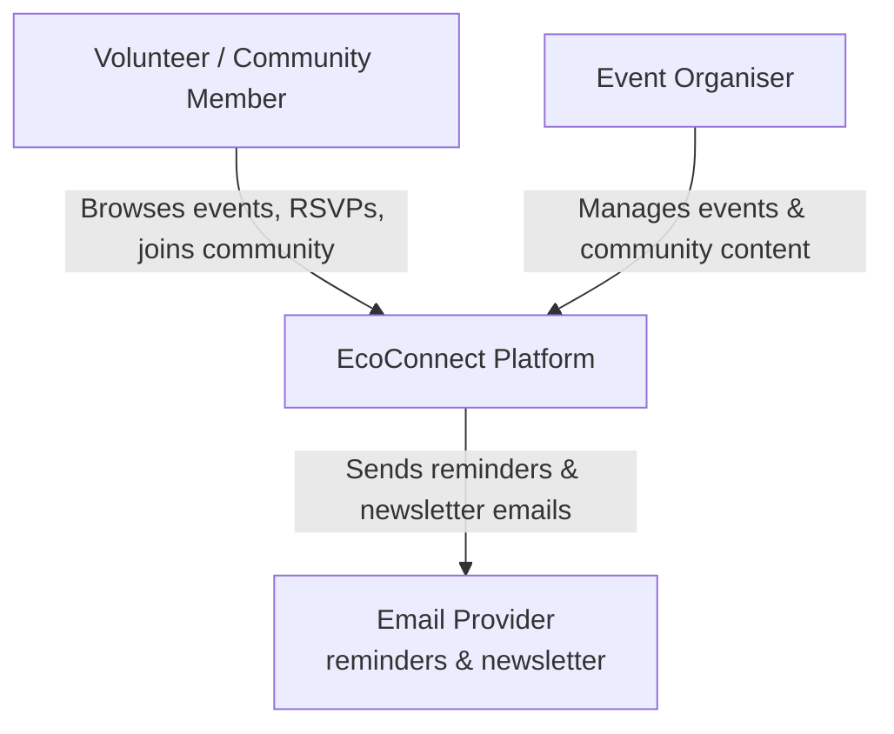
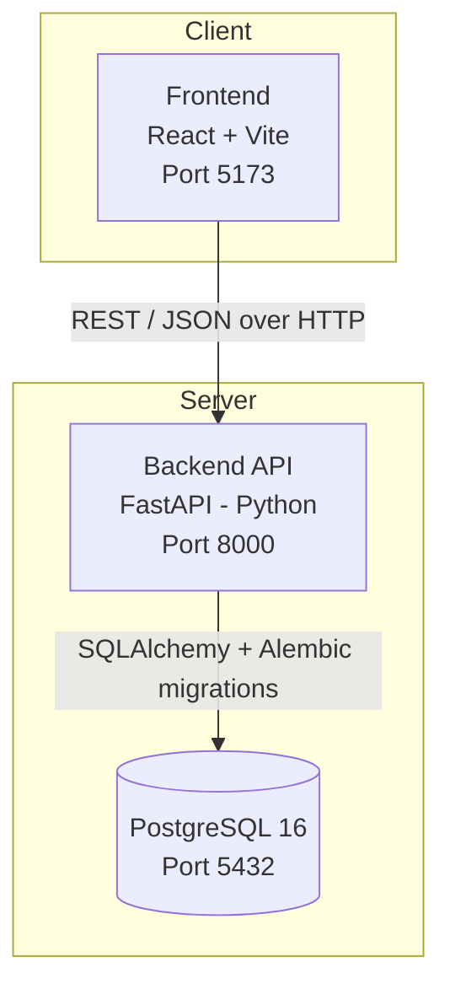

# EcoConnect

This platform connects people with local environmental volunteering events, helping them contribute to sustainability while improving mental well-being and community engagement.

## Team

| Role | Name |
|---|---|
| Product Owner | Mohammed Abid Ali Sameer |
| Scrum Master | Yogesh Chelluboina |
| Developer | Amarendar Reddy |
| Developer | Mogili Vineeth Reddy |
| Developer | Akash Pulluri |

## Project Overview

EcoConnect is a community-driven web platform that helps environmentally conscious students, local residents, and volunteers discover and join nearby environmental volunteering events. Unlike generic event-listing sites or social platforms, EcoConnect focuses specifically on hyper-local eco-events, easy registration, and building community around sustainability action.

Core capabilities implemented so far:

- **Event discovery** – browse and search environmental volunteering events
- **Event details** – view descriptions, timings, and requirements for each event
- **RSVP / registration** – quick sign-up for an event with contact details
- **Reminders & notifications** – automated reminder emails for upcoming registered events
- **Interactive event location maps** – embedded Leaflet/OpenStreetMap view on each event's details page, with a "View in Maps" link out to Google Maps for directions
- **Community page** – community groups, activity feed, testimonials, and photo gallery
- **Impact stats** – aggregated participation/impact numbers shown on Home, About, and Community pages
- **Newsletter subscription** – email opt-in for updates
- **Legal & accessibility pages** – Privacy Policy, Terms of Service, and Accessibility statement

See [docs/vision.md](docs/vision.md) for the full product vision, target users, feature list, and out-of-scope items for v1.

## Architecture

A **C4 Context diagram** shows, at the highest level, how the system fits in with its users and any external systems it depends on. The diagram below is EcoConnect's context view, followed by a container-level breakdown of the services that make up the system today.

### System Context



### Containers



All three containers are defined in [docker-compose.yml](docker-compose.yml) and run together with `docker compose up`.

### Services

Each container above has its own README under [`services/`](services/) with its full API/routes, environment variables, and tech stack:

| Service | Description |
|---|---|
| [services/frontend](services/frontend/README.md) | React/Vite web client |
| [services/backend](services/backend/README.md) | FastAPI REST API |
| [services/database](services/database/README.md) | PostgreSQL data store |

## Tech Stack

| Layer | Technology |
|---|---|
| Frontend | React 19, Vite, React Router, Lucide icons, Leaflet / react-leaflet |
| Backend | Python, FastAPI, SQLAlchemy, Alembic (migrations), Uvicorn |
| Database | PostgreSQL 16 |
| Deployment | Docker & Docker Compose |
| Testing | Pytest (backend) |

## Getting Started

### Prerequisites

- [Docker](https://docs.docker.com/get-docker/) and Docker Compose installed
- Git

### Run locally (Docker)

```bash
git clone https://github.com/JustAbid/AppliedITProject2.git
cd AppliedITProject2
docker compose up --build
```

- Frontend: `http://localhost:5173`
- Backend API: `http://localhost:8000` (health check at `/health`)
- Database: PostgreSQL on `localhost:5432` (db: `ecoconnect`, user/password: `postgres`)

On startup, the backend automatically waits for the database, runs Alembic migrations, and seeds initial events/community content.

### Run locally (without Docker)

**Backend**

```bash
cd backend
python -m venv .venv
.venv\Scripts\activate        # Windows
pip install -r requirements.txt
uvicorn app.main:app --reload --port 8000
```

**Frontend**

```bash
cd frontend
npm install
npm run dev
```

The frontend expects the backend URL in `frontend/.env` as `VITE_API_URL` (defaults to `http://localhost:8000`).

### Running tests

```bash
# Backend (from backend/)
pytest
```

## API Overview

All backend routes are prefixed with `/api` and defined under [backend/app/controllers/](backend/app/controllers/):

| Method | Path | Description |
|---|---|---|
| GET | `/health` | Service health check |
| GET | `/api/events` | List all events |
| GET | `/api/events/{event_id}` | Get a single event |
| POST | `/api/events/{event_id}/registrations` | Register/RSVP for an event |
| GET | `/api/community/groups` | List community groups |
| GET | `/api/community/activity` | List recent community activity |
| GET | `/api/community/gallery` | List gallery images |
| GET | `/api/testimonials` | List testimonials (optional `context` filter) |
| GET | `/api/stats` | List impact stats (optional `section` filter) |
| POST | `/api/newsletter/subscribe` | Subscribe an email to the newsletter |

## Repository Structure

```
├── README.md
├── docker-compose.yml
├── backend/
│   ├── app/
│   │   ├── controllers/       # FastAPI routers (events, registrations, community, stats, newsletter)
│   │   ├── models/            # SQLAlchemy models
│   │   ├── schemas/           # Pydantic schemas
│   │   ├── services/          # Business logic (registrations, notifications, seeding)
│   │   ├── migrations/        # Alembic migrations
│   │   ├── database.py
│   │   └── main.py            # FastAPI app entrypoint
│   ├── tests/                 # Pytest test suite
│   └── requirements.txt
├── frontend/
│   ├── src/
│   │   ├── components/        # Shared & UI components
│   │   ├── pages/              # Route-level pages (Home, Events, Community, About, etc.)
│   │   ├── context/             # React context (theme)
│   │   ├── hooks/               # Custom hooks
│   │   ├── services/            # API client
│   │   ├── styles/               # Per-component CSS
│   │   └── utils/                # Helpers (calendar, time formatting, maps)
│   └── package.json
├── services/                  # Per-service docs (API, env vars, tech stack)
│   ├── frontend/README.md
│   ├── backend/README.md
│   └── database/README.md
└── docs/
    ├── vision.md               # Product vision, personas, feature list
    ├── Personas.md
    ├── UserStories.md
    ├── scenarios.md
    ├── sessionslog.md          # Team session log
    └── MVC_LAB/                # Individual MVC lab exercises
```

## Documentation

- [Vision Document](docs/vision.md)
- [Personas](docs/Personas.md)
- [User Stories](docs/UserStories.md)
- [Scenarios](docs/scenarios.md)
- [Session Log](docs/sessionslog.md)

## License

MIT
